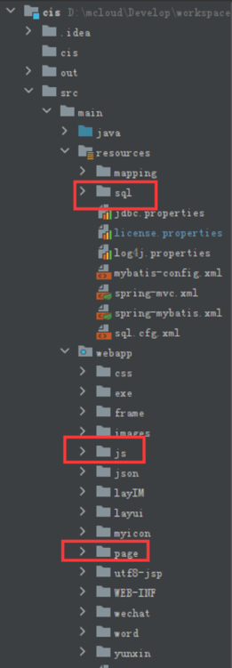
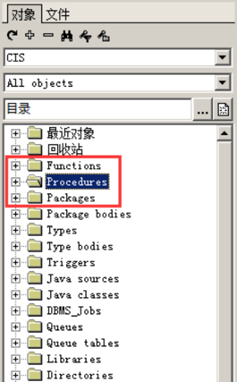
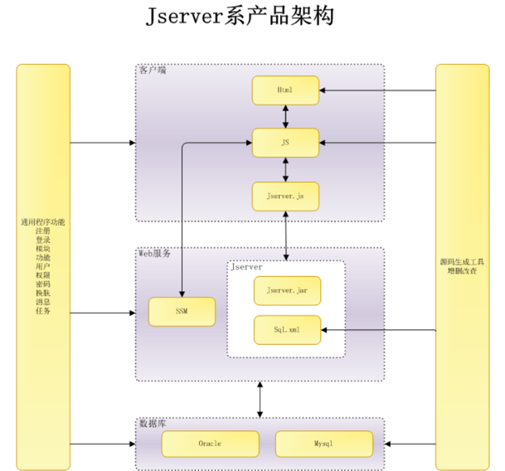
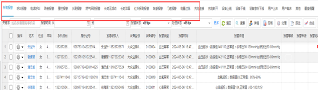
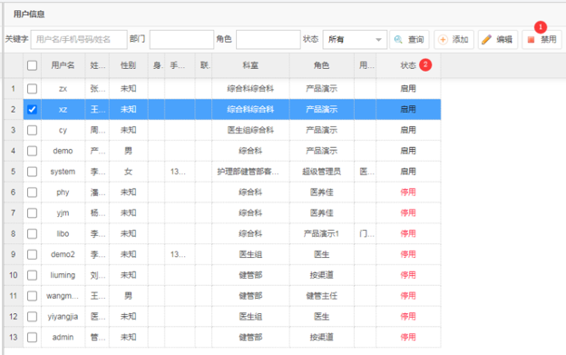
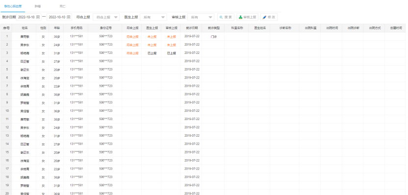

# 初次试用
---
## 一、产品架构
### 1、产品源码
https://39.98.163.57:82/svn/cis/cis  
  

数据库文件:  

### 2、产品架构  

### 3、参考CIS基础数据客户类型page/data/rylx.html，主要参考点：
（1）通过jserver查询数据  
（2）添加、编辑、删除的操作  
（3）Datagrid的字段颜色格式化

### 4、参考CIS智能监测综合报警page/znfw/bjjl.html，主要参考点：
（1）顶部标签切换

### 5、参考CIS系统管理用户信息page/system/user.html，主要参考点：
（1）禁用和启用的切换  
（2）状态的颜色显示

---
## 二、任务说明
### 1、开发模块：基础数据疾病记录page/data/jibingjl.html
### 2、数据结构

### 3、开发原型

### 4、功能说明
（1）标签:根据表中的[筛选类型]来查  

（2）搜索条件：  
就诊日期：默认当月  
符合上报：所有、符合上报（默认）、否  
医生上报：所有（默认）、未上报、已上报  
审核上报：所有（默认）、未上报、已上报  

（3）列表：  
按创建时间排倒序  
符合上报/医生上报/审核上报：不同的状态颜色不一样

（4）审核上报：弹出窗口填写上报说明后保存

（5）修改：展示表中的所有字段，其中筛选上报、筛选说明、筛选时间、审核上报、审核上报时间、审核上报说明可修改，其他的字段不可修改；

### 5、其他说明
`
其他的正确性、易用性、默认值、美观性等根据自己的经验水平尽可能符合规范化、商业产品化的要求（此条做为考核的要点）
`

---
## 三、任务心得与记录
### 1.我需要做的事情:
1.确认后端接口：检查疾病记录.get疾病记录List、update疾病记录部分字段等接口是否存在且正确  
2.修复默认值：将符合上报默认值改为"所有"  
3.添加排序参数：在loadDataGridData中添加按创建时间倒序  
4.完善修改弹窗：补充缺失的字段（如出院诊断、出院方式等）  
5.优化状态颜色：统一符合上报/医生上报/审核上报的颜色显示逻辑  
6.考虑是否需要增删功能：如果只是查询和审核上报，可能不需要  

### 2.我遇到的问题:
Oracle数据库字段用了ZHS16GBK字符集（GBK编码的简体中文），而JDBC驱动本身并不自带中文字符集的转换支持，所以报错说缺少orai18n.jar  
Oracle把orai18n.jar（NLS国家语言支持包）放在了Maven的com.oracle.database.nls组里，而不是com.oracle.database.jdbc组。我一开始写错了组名，导致IDE找不到,我去Maven中央仓库确认了：  
com.oracle.database.nls:orai18n:21.9.0.0是存在的（HTTP200，有1.6MB的jar） 这个版本与ojdbc8（21.9.0.0）是配套的  

### 3.编写思路：
项目在页面里通过jserver.js做数据交互，典型写法是：  
jserver.loadData('jserver',"模块名.方法名",参 数对象,function(data){...})查询  
jserver.update("模块名.方法名",参数对象,function(data){...})保存/更新  
列表页还会用到jserver.loadDataGridData(...)这类表格数据加载  
这和架构图里「HTML/JS↔Jserver.js↔Jserver.jar+Sql.xml」这条线是同一套思路；另一边若还有SSM，则可能是部分模块走SpringMVC接口，但很多页面已经集中在Jserver这条链路上。  

### 4.修改的内容:
#### 4.1 formatter颜色（jibingjl.js）
| 字段     | 状态值 | 颜色 | 说明     |
| -------- | ------ | ---- | -------- |
| 符合上报 | 1      | 绿色 | 符合上报 |
| 符合上报 | 0      | 橙色 | 其他     |
| 医生上报 | 1      | 绿色 | 已上报   |
| 医生上报 | 0      | 橙色 | 未上报   |
| 医生上报 | 2      | 灰色 | 忽略上报 |
| 医生上报 | 3      | 橙色 | 重新上报 |
| 审核上报 | 1      | 绿色 | 已上报   |
| 审核上报 | 0      | 橙色 | 未审核   |
| 审核上报 | 2      | 灰色 | 忽略上报 |
| 审核上报 | 3      | 橙色 | 重新上报 |

#### 4.2修改弹窗tid属性（jibingjl.html）
`
审核上报说明和审核上报时间两个字段补上了tid属性，确保jserver.setValues能正确回填、getInputData能正确取值。
`

#### 4.3 保存逻辑（jibingjl.js）
`
btn_save1里补了params.审核上报时间=$('审核上报时间').datetimebox('getValue')，因为datetimebox在getInputData中只取到了显示文本，需要手动补入。
`

### 5.页面已完整实现的功能
| 功能                         | 说明                                                                                         |
| ---------------------------- | -------------------------------------------------------------------------------------------- |
| 顶部标签切换                 | 急性心脑血管/肿瘤/死亡，按筛选类型查询                                                      |
| 就诊日期默认当月             | `initData` 中自动计算当月首末日                                                             |
| 符合上报默认「符合上报」     | 默认值 `value="1"`                                                                           |
| 医生/审核上报默认「所有」    | 默认空值                                                                                     |
| 按创建时间倒序               | `SQL order by 创建时间 desc`                                                                  |
| 三列颜色显示                 | 已修复                                                                                       |
| 审核上报弹窗                 | 填上报时间+说明，`update` 疾病记录审核信息                                                   |
| 修改弹窗                     | 只读字段 `disabled`，可编辑字段（筛选上报、筛选说明、筛选时间、审核上报、审核上报时间、审核上报说明）均可正常保存 |
| 分页                         | 20 条/页                                                                                     |

### 6.与参考的对照关系
| 分类       | 优化需求说明                                                                                                                                                                                                 |
| ---------- | ------------------------------------------------------------------------------------------------------------------------------------------------------------------------------------------------------------ |
| 参考（疾病记录里怎么对齐） | 顶部改与 bijl.html 一致：.container→.colmd12.top→ul.ul；Tab 点击用$(this).addClass('find_nav_cur').siblings().removeClass('find_nav_cur')，再改 queryType 并 loadDataGridData（与 bijl.js 里 load 报警类型的绑定一致）。样式块也按 bijl 的 top/ul/find_nav_cur 收敛，去掉单独的 jilj/jbul。 |
| 综合报警 bijl | 文件头/疾病记录、initData()+loadDataGridData(page.rows) 及中文注释块与 rylx 同结构；查询、审核、修改里进行统一：isver.getSelectedTable('table','ID')+if(id==null)return；打开修改前 isver.resetValues+loadData+setValues，与 rylx 编辑流程一致。|
| 人员类型 rylx | 列表里「符合上报/医生上报/审核上报」不再写行内 style，改为 jb_grid_ok/jb_grid_warn（色值对齐 user里 formatStatic 的 151414 思路+原型橙色），和用 class 控制状态色的习惯一致。|
| 用户信息 user | （注：原文未展示用户信息板块完整内容，此处按可见信息整理）|

---
## 四、开发步骤
### 1.疾病记录页面开发（jibingjl.html+jibingjl.js）

前端页面（jibingjl.html）：  
-参照同项目`rylx.html`、`bjjl.html`、`system/user.html`三个参考页面的风格进行仿写  
-实现顶部Tab分类栏（三个疾病类型切换，切换时重新按`筛选类型`查列表）  
-实现工具栏：就诊日期范围（EasyUIdatebox）、三项上报状态下拉框（EasyUIcombobox）、搜索/审核上报/修改三个功能按钮  
-实现DataGrid列表（17列，含姓名、性别、年龄、脱敏手机、脱敏身份证、状态色、三项上报时间等）  
-实现「审核上报」弹窗：审核结果下拉+说明文本+提交按钮  
-实现「修改记录」弹窗：左侧只读展示区+右侧可编辑区（筛选说明+审核上报）  
-调整`tb`工具栏DOM位置（放在表格上方），解决Ajax子页注入后EasyUIparser顺序导致的组件初始化异常  

业务逻辑（jibingjl.js）：  
-`runPageInitWhenReady()`：解决Ajax动态注入页面时脚本执行早于EasyUI$.parser完成导致的`optionsundefined`报错，确保datebox就绪后再执行`initData`  
-`initData()`：设置默认就诊日期（当月）、默认「符合上报」=「是」，触发首次列表加载  
-`loadDataGridData()`：调用`jserver.loadDataGridData()`拉列表，传入Tab对应的`筛选类型`及查询参数  
-`format`系列函数：身份证/手机脱敏、性别文字映射、三项上报状态格式化（带颜色class）  
`btn_shangbao`（审核上报）：调用`jserver.loadData()`加载单条详情，填入审核弹窗  
`btn_save`（审核上报保存）：调用`jserver.update()`执行`update疾病记录审核信息`，成功后关闭弹窗并刷新列表  
`btn_update`（修改记录）：加载完整只读信息+已上报字段，可编辑「筛选说明」和「审核上报」两部分  
`btn_save1`（修改保存）：调用`jserver.update()`执行`update疾病记录部分字段`，仅更新筛选/审核相关字段  
Tab点击切换`queryType`，重新`loadDataGridData`实现分类展示  

### 2.SQL语句分析（疾病记录.sql.xml）
分析现有SQL：`get疾病记录List`（分页列表+join个人信息表）、`get疾病记录Count`（条件统计）、`update疾病记录审核信息`（审核保存）、`update疾病记录部分字段`（修改保存）  
确认前端页面使用的字段名（`筛选类型、筛选上报、医生上报、审核上报、就诊日期、创建时间`等）与SQL查询的`t.`字段一致，无需修改XML  
在XML中补充注释，说明各SQL的用途和依赖的列，便于后续维护  

### 3.问题排查与解决
EasyUI初始化时机问题：Ajax子页注入后`initData()`立即执行导致`datebox('setValue')`报错，页面表头变纯文字、无表格工具栏→通过`runPageInitWhenReady()`轮询等待组件就绪解决  
列表数据为0的排查：通过后端日志确认SQL链路正常，问题为查询条件（当月+符合上报=1）与库中历史数据不匹配→增加联调开关`JB_DEV_WIDE_DATE_RANGE`，方便调试  
SQL中`''isnull`在Oracle的行为：空字符串在Oracle视为NULL，导致条件不生效（实际不影响功能，但需注意语义）

---
## 五、技术收获
+ EasyUI在Ajax子页中的初始化时机：Ajax注入的页面脚本在eval执行时，$.parser可能尚未完成组件解析；需要通过`$.parser.complete`或组件`data()`判断就绪后再操作
+ Oracle中空字符串与NULL的等价性：SQL条件中`''isnull`在Oracle下永远为真，设计筛选条件时需注意
+ jserver前后端约定：前端通过`namespace.sqlid`调用SQL，参数以冒号前缀（如`:筛选类型`），后端自动替换注入
+ 参考页面仿写方法：同一项目内的参考页面（rylx/bjjl/user）是最佳实践，学习其文件结构、JS规范、HTML组件顺序可快速掌握项目风格

---
## 六、后续可优化方向
`JB_DEV_WIDE_DATE_RANGE` 联调开关在验收完成后应删除或统一管理    
可考虑将「三项上报」的状态文案和颜色配置抽取为公共方法，与`user.js`中的状态样式保持一致  
修改弹窗中左侧只读区字段较多，可考虑改用DataGrid的只读列展示，减少手动拼字段的维护成本  
